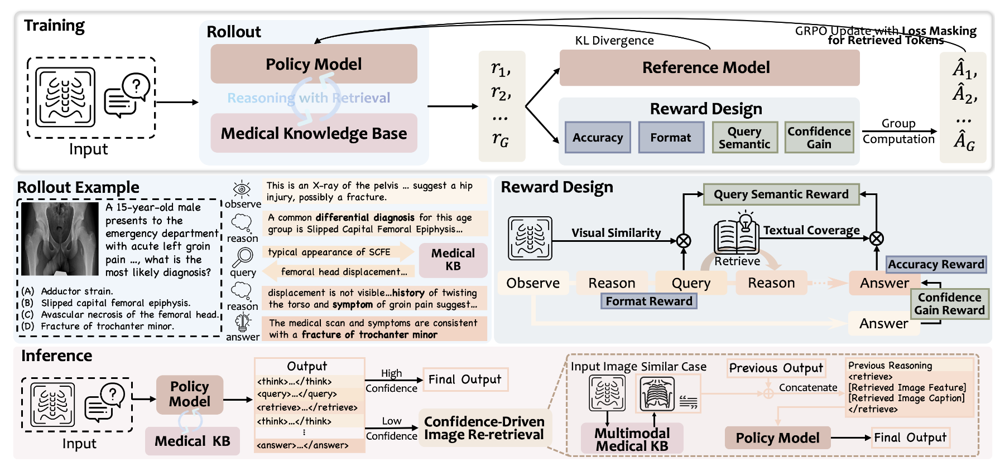

#  Med-RwR

[](https://www.arxiv.org/abs/2510.18303) [](https://huggingface.co/Luxuriant16/Med-RwR)

# 📍 Overview
Med-RwR is **the first Multimodal Medical
Reasoning-with-Retrieval framework**, which proactively retrieves external knowledge by querying observed symptoms or domain-specific medical concepts during reasoning. This approach encourages the model to ground its diagnostic analysis in verifiable external information retrieved after analyzing both visual and textual inputs.

<div align="center">



*Overview of Med-RwR framework*

</div>

# 🔥 News
- [2025/11] Demo codes released.
- [2025/11] The model is released on [HuggingFace](https://huggingface.co/Luxuriant16/Med-RwR).
- [2025/10] The paper is available on [arXiv](https://arxiv.org/abs/2510.18303).

# 🛠️ Environment Installation
The required dependencies are as follows.
```bash
conda create -n medrwr python==3.10
conda activate medrwr
pip install torch==2.5.1 torchvision==0.20.1 torchaudio==2.5.1 --index-url https://download.pytorch.org/whl/cu124
pip install -r requirements.txt
```

Our code is implemented based on [SWIFT](https://github.com/modelscope/ms-swift). Please setup the required version (v3.3.0) with the following commands.
```bash
git clone https://github.com/xmed-lab/Med-RwR.git
pip install -e .
```

# ⚡️ Quick Start
## Start the Retriever
The knowledge base is available at [HuggingFace](https://huggingface.co/Luxuriant16/Med-RwR/tree/main/knowledge_base). Please download from the link and put inside `retrieve/knowledge_base`.

Start the retriever, where we employ [BGE-M3](https://huggingface.co/BAAI/bge-m3) as an example:
```python
python retrieve/retrieve.py
```

## Inference
Run the demo code:
```python
python demo.py
```
Update the question and image path in the code with your own values before running it.


# 🙏 Acknowledgements
We refer to the codes from [SWIFT](https://github.com/modelscope/ms-swift), [R1-Searcher](https://github.com/RUCAIBox/R1-Searcher), [ZeroSearch](https://github.com/Alibaba-NLP/ZeroSearch). Thank the authors for their contribution to the community.

# 📚 Citation
If you find this project useful, please consider citing:
```
@article{wang2025proactive,
  title={Proactive Reasoning-with-Retrieval Framework for Medical Multimodal Large Language Models},
  author={Wang, Lehan and Qin, Yi and Yang, Honglong and Li, Xiaomeng},
  journal={arXiv preprint arXiv:2510.18303},
  year={2025}
}
```